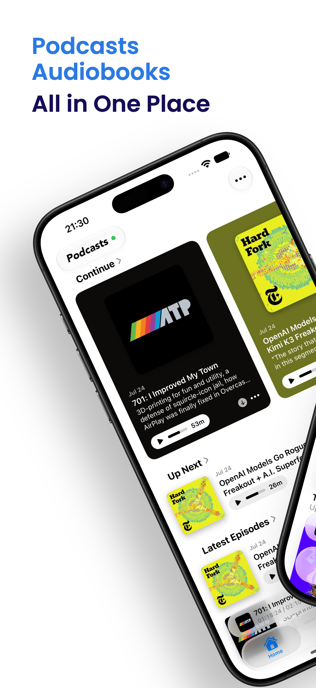
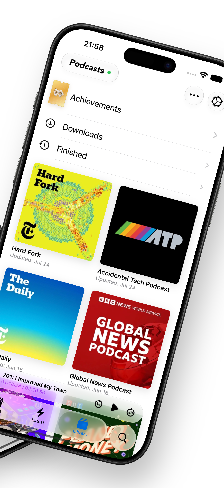
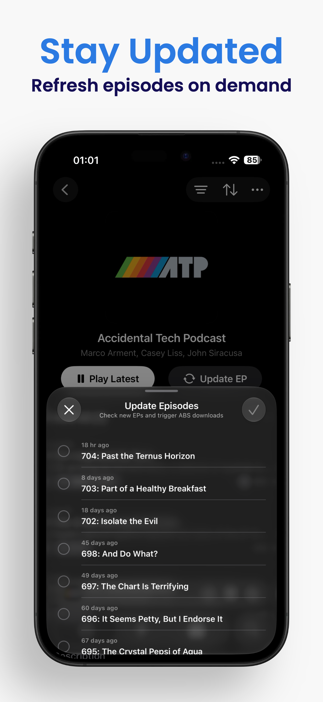
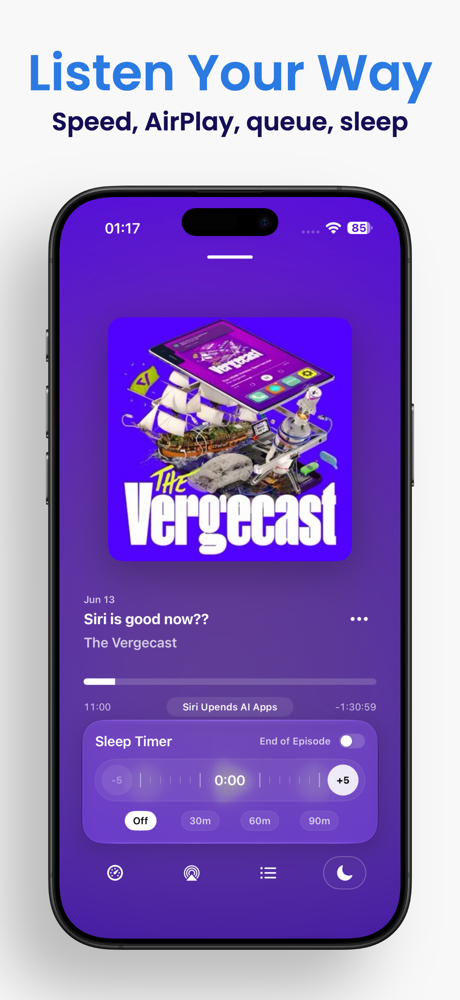
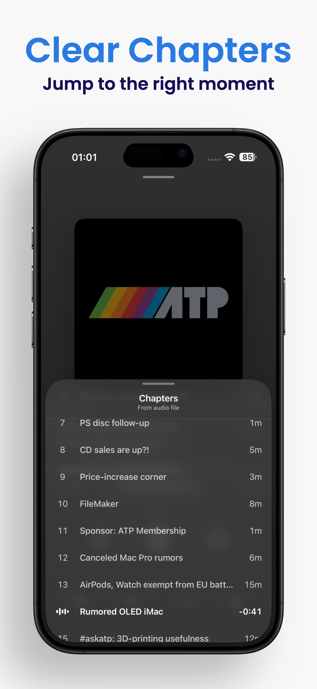
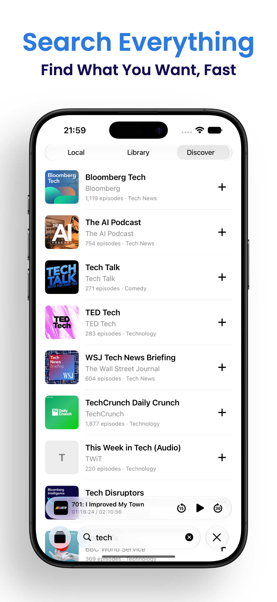
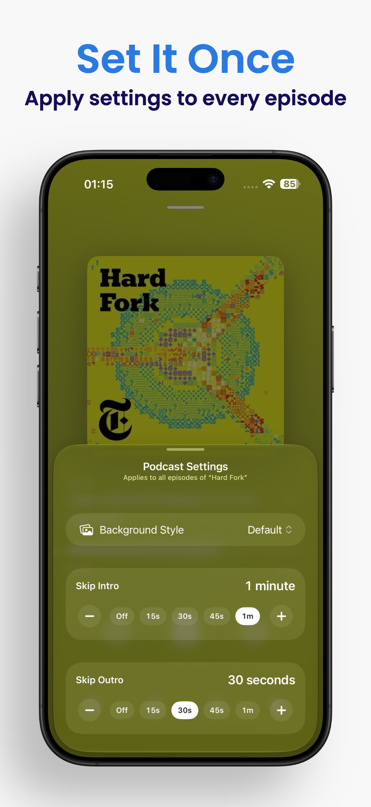
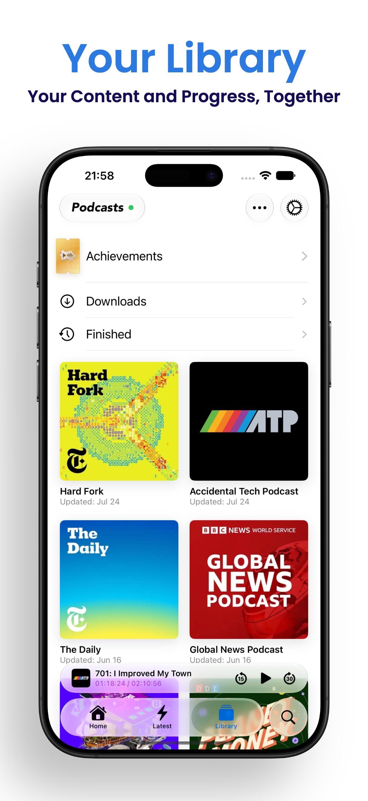

# ShelfPod

> **In the AI era, ideas are abundant. Taste is scarce.**

A native iPhone and iPad client for podcasts and audiobooks on self-hosted [Audiobookshelf](https://www.audiobookshelf.org/) servers.

ShelfPod does not ship AI slop. A large part of the work goes into the details that decide whether an app feels coherent: interface, navigation, spacing, motion, gestures, scrolling, feedback, and predictable playback behavior.

**[Download on the App Store](https://apps.apple.com/app/id6781744751)** &middot; **[Join the TestFlight beta](https://testflight.apple.com/join/wszEWVsw)**

  &nbsp;&nbsp;
  &nbsp;&nbsp;
  &nbsp;&nbsp;
  

  &nbsp;&nbsp;
  &nbsp;&nbsp;
  &nbsp;&nbsp;
  

## What ShelfPod Does

- Browse podcast and audiobook libraries from your Audiobookshelf server
- Stream or download media for offline listening
- Read show notes, navigate chapters, and save audiobook bookmarks
- Build and reorder Up Next
- Adjust playback speed, use a sleep timer, and set per-podcast intro and outro skipping
- Keep progress current with Audiobookshelf, with optional live cross-device sync

## Active Development

Development began in May 2026. TestFlight builds followed in June, and ShelfPod launched on the App Store on August 12.

Updates are frequent and guided by real-world use and tester feedback.

## Requirements

- iOS or iPadOS 26.0 or later
- An existing Audiobookshelf server and account

ShelfPod does not include media or provide an Audiobookshelf server. Some advanced features are available through optional ShelfPod Premium.

## Feedback and Support

- [Report a bug or request a feature](https://github.com/Ryziii/ShelfPod-community/issues/new/choose)
- [View existing issues](https://github.com/Ryziii/ShelfPod-community/issues)
- [Support](https://shelfpod.pages.dev/support/)
- [Privacy Policy](https://shelfpod.pages.dev/privacy/)
- [Terms of Use](https://shelfpod.pages.dev/terms/)

For bug reports, include the ShelfPod version, iOS or iPadOS version, Audiobookshelf server version, connection type, and clear reproduction steps. Never post passwords, access tokens, private feed URLs, or unredacted logs.

ShelfPod is independently developed and is not affiliated with or endorsed by the Audiobookshelf project.
